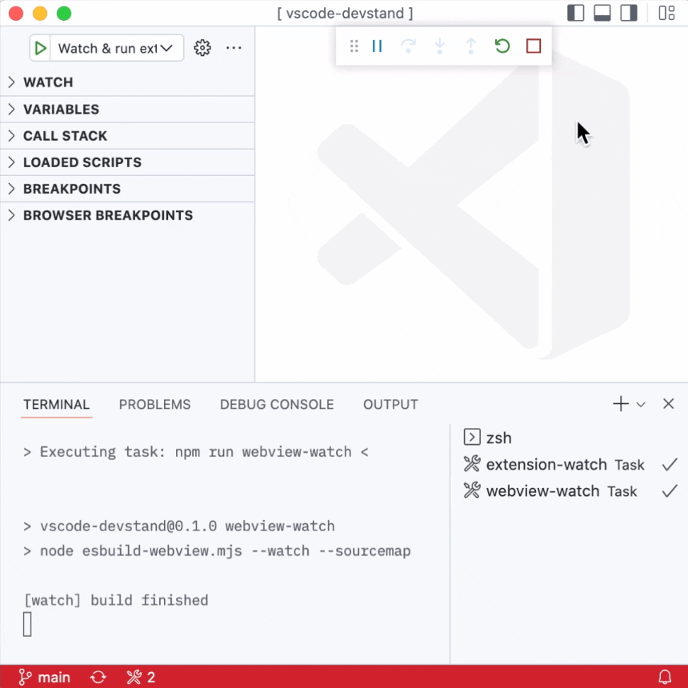

# Stop debug and Terminate tasks

Usually a debug session is initiated with configuration from `.vscode/launch.json`.
That configuration can contain a specific `preLaunchTask` that kicks off background tasks.
But when you stop your debug session these background task are still being executed.

The given extension offers a new macro-like command that does two things:

- Stop active debug session
- Terminate all running tasks

Bind the command to a keyboard shortcut (if you wish) or invoke it via command palette (like in the video below)

